# DARQCUBE-AGENTICOPS-STACK

A single-VM network telemetry, source-of-truth and automation stack for
**Cisco IOS-XE**, **Huawei VRP** and **MikroTik RouterOS**. Docker Compose,
containers grouped and tagged by function, everything driven from YAML.

Built for demos, proofs of concept and small production networks —
**sized and tested to 400 devices** on one Ubuntu box.

It does four things:

- **Devices send telemetry to it** — Telegraf ingests SNMP, gNMI and
  NetFlow/IPFIX; Logstash ingests syslog.
- **Infrahub holds what should exist** — every metric and log line is labelled
  from it, so they line up on the same device.
- **Automation gets and puts** configuration and state — Nornir, Netmiko,
  TextFSM, TTP, with vendor-neutral assurance checks.
- **MCP servers expose all of it** to an AI platform, if you want one.

## Works with or without AI

Everything here works standalone. Grafana dashboards, Prometheus alerts, Loki
log search and the automation API are all usable by a person with no AI
involved.

The six MCP servers are an *additional* interface onto the same data. Nothing in
the stack depends on them — drop `mcp` from `COMPOSE_PROFILES` and every other
feature is unaffected. That is a structural property, not a claim: MCP sits at
the bottom of the dependency graph with no inbound edges, and the test suite
checks it.

## Architecture

```mermaid
flowchart LR
  subgraph DEV["Network Devices"]
    direction TB
    C["Cisco IOS-XE"]
    H["Huawei VRP"]
    M["MikroTik RouterOS"]
  end

  subgraph VM["Single VM — Docker Compose"]
    direction TB
    subgraph SOT["📋 source-of-truth"]
      IH["Infrahub"]
    end
    subgraph OBS["📊 observability"]
      direction LR
      TG["Telegraf"]
      LS["Logstash"]
      PR[("Prometheus")]
      LK[("Loki")]
      AM["Alertmanager"]
      GF["Grafana"]
    end
    subgraph AUT["⚙️ automation"]
      AU["Nornir · Netmiko<br/>TextFSM · TTP"]
    end
    subgraph MCPG["🔌 mcp"]
      MS["6 servers"]
    end
  end

  AIP["🤖 AI-Platform<br/>(optional)"]

  DEV -. "SNMP · gNMI" .-> TG
  DEV == "NetFlow / IPFIX" ==> TG
  DEV == "syslog" ==> LS
  AU -. "SSH — get / put" .-> DEV

  IH -. "device · site · role" .-> OBS
  IH -. "inventory" .-> AU
  TG --> PR --> AM
  LS --> LK
  PR --> GF
  LK --> GF
  OBS --- MS
  IH --- MS
  AU --- MS
  MS -. optional .-> AIP
  AM -. optional .-> AIP

  %% Colour follows the four container groups — the same grouping as the
  %% com.darqcube.group label. Light fills with explicit dark text, so the
  %% diagram stays readable in GitHub's light AND dark themes.
  classDef device  fill:#dbeafe,stroke:#1d4ed8,stroke-width:2px,color:#1e293b
  classDef sot     fill:#fef3c7,stroke:#b45309,stroke-width:2px,color:#1e293b
  classDef collect fill:#dcfce7,stroke:#15803d,stroke-width:2px,color:#1e293b
  classDef store   fill:#cffafe,stroke:#0e7490,stroke-width:2px,color:#1e293b
  classDef alert   fill:#fee2e2,stroke:#b91c1c,stroke-width:2px,color:#1e293b
  classDef ui      fill:#f3e8ff,stroke:#7e22ce,stroke-width:2px,color:#1e293b
  classDef auto    fill:#ffedd5,stroke:#c2410c,stroke-width:2px,color:#1e293b
  classDef mcp     fill:#ccfbf1,stroke:#0f766e,stroke-width:2px,color:#1e293b
  classDef ai      fill:#e2e8f0,stroke:#475569,stroke-width:2px,stroke-dasharray:5 3,color:#1e293b

  class C,H,M device
  class IH sot
  class TG,LS collect
  class PR,LK store
  class AM alert
  class GF ui
  class AU auto
  class MS mcp
  class AIP ai

  style DEV  fill:#f8fafc,stroke:#1d4ed8,stroke-width:2px,color:#1e293b
  style VM   fill:#ffffff,stroke:#94a3b8,stroke-width:2px,color:#1e293b
  style SOT  fill:#fffbeb,stroke:#b45309,color:#1e293b
  style OBS  fill:#f0fdf4,stroke:#15803d,color:#1e293b
  style AUT  fill:#fff7ed,stroke:#c2410c,color:#1e293b
  style MCPG fill:#f0fdfa,stroke:#0f766e,color:#1e293b

  %% Thick = the device pushes to us. Dotted = we reach out to the device.
  linkStyle 0 stroke:#1d4ed8,stroke-width:2px
  linkStyle 1,2 stroke:#15803d,stroke-width:3px
  linkStyle 3 stroke:#c2410c,stroke-width:2px
  linkStyle 4,5 stroke:#b45309,stroke-width:2px
  linkStyle 6,7,8,9,10 stroke:#0e7490,stroke-width:2px
  linkStyle 11,12,13 stroke:#0f766e,stroke-width:1px
  linkStyle 14,15 stroke:#475569,stroke-width:1px
```



Dashed = the stack reaches out. Solid = the device pushes to us.
Full diagrams and the "what breaks if X is down" table:
[docs/architecture.md](docs/architecture.md).

## Install

On a fresh Ubuntu Server, prepare the host once:

```bash
sudo apt update && sudo apt install -y git make jq python3-venv curl
curl -fsSL https://get.docker.com | sh
sudo usermod -aG docker "$USER" && newgrp docker
```

Then:

```bash
git clone <this repo> && cd DARQCUBE-AGENTICOPS-STACK
sudo python3 install.py --fix-sysctl          # UDP buffers, once per host
cp site.example.yml site.yml && chmod 600 site.yml
$EDITOR site.yml                              # ten fields describing this deployment
python3 install.py
```

That is the whole thing. One file, standard library only, seven steps:
preflight the host → generate `.env` → build the images → start and wait for
healthy → load the schema, seed and render → **run pytest against the running
stack** → tell you where everything is.

It stops at the first step that cannot succeed, and re-running is safe —
nothing already holding a real value is overwritten.

```bash
python3 install.py --check        # preflight only, changes nothing
sudo python3 install.py --fix-sysctl   # UDP buffers (see below)
```

`site.yml` describes one deployment: this VM's routable IP, the device
credentials, and roughly how many devices there are — which picks the polling
interval, SNMP shard size and concurrency for you. It generates `.env` and
**touches nothing else**, so the repository stays clean and these docs never
become customer-specific. It is gitignored; it holds credentials.

Skip it and `install.py` prompts instead — fine for a one-off, but the site
file is also the record of what you deployed.

> **One host setting matters before real traffic arrives.** Devices push syslog
> and flow over UDP, and stock Ubuntu's socket buffer is 208 KiB against the
> 8 MiB the collectors ask for. The kernel clamps the request silently, so the
> loss has no error and no log line. `--fix-sysctl` sets and persists it.

Prefer to do it yourself? The same steps by hand, and what each one is for:
[docs/INSTALL.md](docs/INSTALL.md#the-manual-way).

## What's in the box

21 containers in four groups. Select a group with
`docker ps --filter "label=com.darqcube.group=observability"`.

| Group | Containers | Published |
|---|---|---|
| **source-of-truth** | infrahub-server, infrahub-worker, neo4j, redis, rabbitmq, task-db, task-manager | Infrahub UI |
| **observability** | telegraf, logstash, prometheus, loki, alertmanager, grafana, config-init | Grafana, Prometheus, Alertmanager, Loki, syslog, NetFlow, IPFIX |
| **automation** | automation | the automation API |
| **mcp** | mcp-infrahub, -prometheus, -loki, -grafana, -netmiko, -assurance | nothing — internal only |

Seven of those are Infrahub's own required backing services; six MCP containers
come from one image.

Ports ship non-standard (Grafana on 13000, etc.) so the stack can run alongside
something already using the usual ones —
[how to revert](docs/how-to/change-ports.md).

## Supported devices

| Platform | Metrics | Flow | Config & state | Assurance |
|---|---|---|---|---|
| **Cisco IOS-XE** | SNMP or gNMI | ✅ | Netmiko `cisco_xe` | ✅ |
| **Huawei VRP** | SNMP | ✅ | Netmiko `huawei_vrp` | ✅ |
| **MikroTik RouterOS** | SNMP | ✅ | Netmiko `mikrotik_routeros` | ✅ |

**Every vendor takes the same code path.** All three produce the same metric
names — `cpu_usage`, `interface_oper_status`, `memory_used_percent` — despite
three different MIBs, and the same assurance rules run against all three
despite three different CLI formats.

Device-side configuration: [docs/devices/](docs/devices/).

## How device work is done

| Layer | Tool | Job |
|---|---|---|
| transport | **Netmiko** | get text off the device, push configuration to it |
| tabular parsing | **TextFSM** + ntc-templates | `show` output → rows |
| config parsing | **TTP** | running-config → structure |
| normalising | `assurance/normalise.py` | three vendors' rows → one shape |
| assurance | `assurance/rules.yml` | declarative checks, YAML-editable |
| comparison | **DeepDiff** | pre/post snapshots → what actually changed |

> **One code path, not one per vendor.** The normaliser is what makes this
> work: Cisco reports `status`/`proto`, Huawei `phy`/`protocol`, MikroTik
> single-letter flags. All three become `{interface, admin_up, oper_up}`, so a
> single `rules.yml` covers the fleet and adding a check is a YAML edit.

```bash
make state DEV=mt-01          # parsed operational state
make check DEV=mt-01          # assurance rules — same rules on every vendor
make snapshot DEV=cr1         # comparable state, for pre/post comparison
make config-get DEV=cr1       # running config
make config-parsed DEV=cr1    # running config, parsed with TTP
make config-put DEV=cr1 FILE=change.txt   # push, and report what changed
```

## Changing things

| I want to… | Where |
|---|---|
| Add a device | `source-of-truth/devices/devices.yml` → [guide](docs/how-to/add-a-device.md) |
| Support a new vendor | `platforms.yml` → [guide](docs/how-to/add-a-platform.md) |
| Add or change an alert | `observability/prometheus/rules/alerts.yml` → [guide](docs/how-to/change-alerts.md) |
| Add or change an assurance check | `automation/assurance/rules.yml` → [guide](docs/how-to/change-assurance-rules.md) |
| Add a metric | `platforms.yml` or the Telegraf profiles → [guide](docs/how-to/add-a-metric.md) |
| Edit a dashboard | `observability/grafana/provisioning/dashboards/` → [guide](docs/how-to/change-dashboards.md) |
| Parse a new syslog format | `observability/logstash/patterns/` → [guide](docs/how-to/add-a-syslog-format.md) |
| Fix a `show` output parse error | `automation/textfsm/` → [guide](docs/how-to/add-a-textfsm-template.md) |
| Parse a device configuration | `automation/ttp/` → [guide](docs/how-to/add-a-ttp-template.md) |
| Change a port | `.env` → [guide](docs/how-to/change-ports.md) |
| Connect an AI platform | [guide](docs/how-to/connect-an-ai-platform.md) |
| Deploy at a customer site | [guide](docs/how-to/deploy-on-customer-premises.md) |
| Chase data loss that produces **no error** | [guide](docs/how-to/fix-silent-data-loss.md) |

**Two rules.** Edit the source, never `observability/telegraf/generated/` — it
is overwritten by `make render`. And two commands propagate a change: `make
seed` updates the source of truth, `make render` pushes it to the collectors.

## Documentation

| | |
|---|---|
| [docs/INSTALL.md](docs/INSTALL.md) | install on a fresh VM — `install.py` or by hand |
| [docs/scale.md](docs/scale.md) | the 400-device envelope and how to grow |
| [docs/how-to/](docs/how-to/) | 16 task guides: add a device, change an alert, add a vendor… |
| [docs/install/](docs/install/) | one page per component — config, ports, verify, problems |
| [docs/devices/](docs/devices/) | device-side config per platform |
| [docs/architecture.md](docs/architecture.md) | diagrams and the failure table |
| [CLAUDE.md](CLAUDE.md) | notes for Claude Code working in this repo |

## Scale

Sized and tested to **400 devices** — about 105,000 Prometheus series, ~1,700
samples/sec, ~4 GB of metrics per 15 days. Prometheus is comfortable there; the
things that break first are all in the collectors, and the defaults account for
them: sharded SNMP polling, a metric buffer larger than one interval's output,
and 8 MiB UDP receive buffers.

The numbers, what to change as you grow, and where the real ceiling is:
[docs/scale.md](docs/scale.md).

Those defaults exist because the failures they prevent are **silent** — dropped
UDP, a full metric buffer, repeated logins. How to detect and fix each one by
hand: [docs/how-to/fix-silent-data-loss.md](docs/how-to/fix-silent-data-loss.md).

## Testing

```bash
make test-templates   # TextFSM parsing — offline, no devices, seconds
make test             # containers running, services answering, components wired
make test-devices     # needs real devices
```

`install.py` runs `make test` as its final step, so a successful install has
already proved the stack is wired — not merely that the containers started.

`make test` is three layers, because "up" and "working" are different claims:
containers healthy, services answering, and — the one that matters —
components actually connected to each other.

Much of the suite runs with no stack at all: the renderer against a stubbed
Infrahub, TextFSM templates against committed CLI samples, the Logstash filter
block against real wire-format syslog lines, the assurance engine against all
three vendors, and the documentation against the repo it describes.

## Status and scope

**This is a demo stack, not a hardened production platform.** No TLS between
components, no authentication in front of Prometheus or Alertmanager beyond
their own, no backup automation, no HA. It is built to be read, understood and
extended. Harden it before putting it anywhere that matters.
