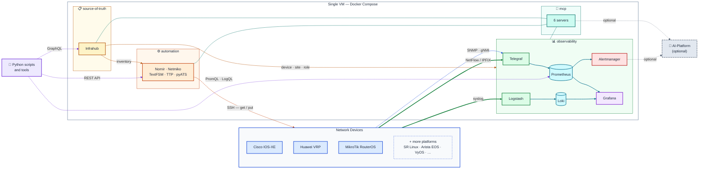

# DARQCUBE-AGENTICOPS-STACK

A single-VM stack for **network intent, observability, automation and
AgenticOps** — one source of truth that everything else is labelled from.
Docker Compose, containers grouped and tagged by function, everything driven
from YAML. Ships with **Cisco IOS-XE**, **Huawei VRP** and **MikroTik
RouterOS**, and takes other platforms — Nokia SR Linux, Arista EOS, VyOS and
more — by [adding them](#more-platforms).

Built for demos, proofs of concept and small production networks —
**sized and tested to 400 devices** on one Ubuntu box.

## Four ways to use it

| Use | What it gives you | Way in |
|---|---|---|
| **Network intent** | Infrahub holds what *should* exist — devices, sites, roles, platforms. Every metric and log line is labelled from it, so all four uses agree on what a device is | Infrahub UI · GraphQL · YAML + `make seed` |
| **Observability** | Telegraf ingests SNMP, gNMI and NetFlow/IPFIX; Logstash ingests syslog. Dashboards, alerts and log search, per device, site and role | Grafana · Prometheus and Loki APIs |
| **Automation** | Get and put configuration, parsed state, assurance checks, pre/post snapshots — Nornir, Netmiko, TextFSM, TTP and pyATS/Genie, across every vendor | `make` targets · REST API · [Python scripts](docs/how-to/automate-with-python.md) |
| **AgenticOps** | The same capabilities as bounded MCP tools for an AI platform — read-only unless writing is explicitly enabled | [MCP servers](docs/how-to/connect-an-ai-platform.md) |

Each use works on its own. Intent is the only one the others depend on.

## Works with or without AI

Everything here works standalone. Grafana dashboards, Prometheus alerts, Loki
log search and the automation API are all usable by a person with no AI
involved.

The six MCP servers are an *additional* interface onto the same data. Nothing in
the stack depends on them — drop `mcp` from `COMPOSE_PROFILES` and every other
feature is unaffected. That is a structural property, not a claim: MCP sits at
the bottom of the dependency graph with no inbound edges, and the test suite
checks it.

## Use it from Python

Scripts use the same stack an AI platform does, over plain HTTP — no SDK:

```python
import json, urllib.request

API = "http://localhost:18100"      # AUTOMATION_PORT
def call(path, method="GET"):
    with urllib.request.urlopen(urllib.request.Request(API + path, method=method), timeout=300) as r:
        return json.load(r)

for dev in call("/devices")["devices"]:
    results = call(f"/device/{dev['name']}/check", method="POST")["results"]
    bad = [r["rule"] for r in results if r["status"] in ("fail", "error")]
    print(dev["name"], "OK" if not bad else bad)
```

Intent over GraphQL, metrics over PromQL, logs over LogQL, and the full API:
[docs/how-to/automate-with-python.md](docs/how-to/automate-with-python.md).

## Architecture


```mermaid
flowchart LR
  subgraph DEV["Network Devices"]
    direction TB
    C["Cisco IOS-XE"]
    H["Huawei VRP"]
    M["MikroTik RouterOS"]
    X["+ more platforms<br/>SR Linux · Arista EOS · VyOS · …"]
  end

  subgraph VM["Single VM — Docker Compose"]
    direction TB
    subgraph SOT["📋 source-of-truth"]
      IH["Infrahub"]
    end
    subgraph OBS["📊 observability"]
      direction LR
      TG["Telegraf"]
      LS["Logstash"]
      PR[("Prometheus")]
      LK[("Loki")]
      AM["Alertmanager"]
      GF["Grafana"]
    end
    subgraph AUT["⚙️ automation"]
      AU["Nornir · Netmiko<br/>TextFSM · TTP · pyATS"]
    end
    subgraph MCPG["🔌 mcp"]
      MS["6 servers"]
    end
  end

  AIP["🤖 AI-Platform<br/>(optional)"]
  PY["🐍 Python scripts<br/>and tools"]

  DEV -. "SNMP · gNMI" .-> TG
  DEV == "NetFlow / IPFIX" ==> TG
  DEV == "syslog" ==> LS
  AU -. "SSH — get / put" .-> DEV

  IH -. "device · site · role" .-> OBS
  IH -. "inventory" .-> AU
  TG --> PR --> AM
  LS --> LK
  PR --> GF
  LK --> GF
  OBS --- MS
  IH --- MS
  AU --- MS
  MS -. optional .-> AIP
  AM -. optional .-> AIP
  PY -. "REST API" .-> AU
  PY -. "GraphQL" .-> IH
  PY -. "PromQL · LogQL" .-> PR

  %% Colour follows the four container groups — the same grouping as the
  %% com.darqcube.group label. Light fills with explicit dark text, so the
  %% diagram stays readable in GitHub's light AND dark themes.
  classDef device  fill:#dbeafe,stroke:#1d4ed8,stroke-width:2px,color:#1e293b
  classDef sot     fill:#fef3c7,stroke:#b45309,stroke-width:2px,color:#1e293b
  classDef collect fill:#dcfce7,stroke:#15803d,stroke-width:2px,color:#1e293b
  classDef store   fill:#cffafe,stroke:#0e7490,stroke-width:2px,color:#1e293b
  classDef alert   fill:#fee2e2,stroke:#b91c1c,stroke-width:2px,color:#1e293b
  classDef ui      fill:#f3e8ff,stroke:#7e22ce,stroke-width:2px,color:#1e293b
  classDef auto    fill:#ffedd5,stroke:#c2410c,stroke-width:2px,color:#1e293b
  classDef mcp     fill:#ccfbf1,stroke:#0f766e,stroke-width:2px,color:#1e293b
  classDef ai      fill:#e2e8f0,stroke:#475569,stroke-width:2px,stroke-dasharray:5 3,color:#1e293b
  classDef extend  fill:#f8fafc,stroke:#1d4ed8,stroke-width:1px,stroke-dasharray:4 3,color:#1e293b
  classDef script  fill:#ede9fe,stroke:#6d28d9,stroke-width:2px,color:#1e293b

  class C,H,M device
  class IH sot
  class TG,LS collect
  class PR,LK store
  class AM alert
  class GF ui
  class AU auto
  class MS mcp
  class AIP ai
  class X extend
  class PY script

  style DEV  fill:#f8fafc,stroke:#1d4ed8,stroke-width:2px,color:#1e293b
  style VM   fill:#ffffff,stroke:#94a3b8,stroke-width:2px,color:#1e293b
  style SOT  fill:#fffbeb,stroke:#b45309,color:#1e293b
  style OBS  fill:#f0fdf4,stroke:#15803d,color:#1e293b
  style AUT  fill:#fff7ed,stroke:#c2410c,color:#1e293b
  style MCPG fill:#f0fdfa,stroke:#0f766e,color:#1e293b

  %% Thick = the device pushes to us. Dotted = we reach out to the device.
  linkStyle 0 stroke:#1d4ed8,stroke-width:2px
  linkStyle 1,2 stroke:#15803d,stroke-width:3px
  linkStyle 3 stroke:#c2410c,stroke-width:2px
  linkStyle 4,5 stroke:#b45309,stroke-width:2px
  linkStyle 6,7,8,9,10 stroke:#0e7490,stroke-width:2px
  linkStyle 11,12,13 stroke:#0f766e,stroke-width:1px
  linkStyle 14,15 stroke:#475569,stroke-width:1px
  linkStyle 16,17,18 stroke:#6d28d9,stroke-width:1.5px
```

Dashed = the stack reaches out. Solid = the device pushes to us.
Full diagrams and the "what breaks if X is down" table:
[docs/architecture.md](docs/architecture.md).

## Install

On a fresh Ubuntu Server, prepare the host once — OS packages, Docker with the
Compose plugin, and your user in the `docker` group:

```bash
git clone <this repo> && cd DARQCUBE-AGENTICOPS-STACK
./scripts/prepare-ubuntu.sh
```

It needs `sudo`, changes nothing else, skips whatever is already done, and ends
by printing the next steps. The same thing by hand:

```bash
sudo apt update && sudo apt install -y git make jq python3-venv curl
curl -fsSL https://get.docker.com | sh
sudo usermod -aG docker "$USER"
```

`install.py` cannot do this itself: `python3-venv`, `make` and Docker are
operating-system packages, not Python ones, and the installer runs before any of
them exist.

Then **log out and back in**. Group membership is read at login, so the current
session cannot see it — `install.py` will report the socket as unreachable until
you reconnect. (`newgrp docker` opens a new shell with the group applied without
reconnecting, but minimal and container images do not always ship it.)

Then install:

```bash
cd ~/DARQCUBE-AGENTICOPS-STACK                # re-login starts in your home folder
sudo python3 install.py --fix-sysctl          # UDP buffers, once per host
cp site.example.yml site.yml && chmod 600 site.yml
ls -l site.yml                                # confirm the copy landed
${EDITOR:-nano} site.yml                      # six required values — docs/INSTALL.md lists them
python3 install.py
```

Your **devices** go in separately — the repo ships no inventory, so Infrahub
starts empty. Add them in the Infrahub UI, or copy
`source-of-truth/devices/examples/*.yml` into `source-of-truth/devices/`, edit,
and `make seed && make render`:
[docs/administration/infrahub-guide.md](docs/administration/infrahub-guide.md).

That is the whole thing. One file, standard library only, seven steps:
preflight the host → generate `.env` → build the images → start and wait for
healthy → load the schema, seed and render → **run pytest against the running
stack** → tell you where everything is.

It stops at the first step that cannot succeed, and re-running is safe —
nothing already holding a real value is overwritten.

```bash
python3 install.py --check        # preflight only, changes nothing
sudo python3 install.py --fix-sysctl   # UDP buffers (see below)
```

`site.yml` describes one deployment: this VM's routable IP, the device
credentials, and roughly how many devices there are — which picks the polling
interval, SNMP shard size and concurrency for you. It generates `.env` and
**touches nothing else**, so the repository stays clean and these docs never
become customer-specific. It is gitignored; it holds credentials.

Skip it and `install.py` prompts instead — fine for a one-off, but the site
file is also the record of what you deployed.

> **One host setting matters before real traffic arrives.** Devices push syslog
> and flow over UDP, and stock Ubuntu's socket buffer is 208 KiB against the
> 8 MiB the collectors ask for. The kernel clamps the request silently, so the
> loss has no error and no log line. `--fix-sysctl` sets and persists it.

Run every command **from the repo folder**. After logging out and back in you
start in your home directory, where `python3 install.py` fails with
`can't open file '/home/<you>/install.py'` — `cd DARQCUBE-AGENTICOPS-STACK` first.

Before installing, check what is **yours to provide** — a VM of the right size,
Ubuntu 22.04 or 24.04, network reachability in both directions between the VM
and the devices, and the devices' own configuration:
[docs/INSTALL.md — Before you start](docs/INSTALL.md#before-you-start).
Size the VM first — [prerequisites](docs/install/01-prerequisites.md#sizing).
The preflight warns about a small VM but does not stop; one below the minimum
fails part-way through the build.

Prefer to do it yourself? The same steps by hand, and what each one is for:
[docs/INSTALL.md](docs/INSTALL.md#3-the-manual-way-if-you-prefer).

Other routes:

| | |
|---|---|
| Containers on a Docker engine you already have, no VM | [run-on-a-docker-engine.md](docs/how-to/run-on-a-docker-engine.md) |
| Move an existing deployment to a new host | [move-to-a-new-host.md](docs/how-to/move-to-a-new-host.md) |

## What's in the box

21 containers in four groups. Select a group with
`docker ps --filter "label=com.darqcube.group=observability"`.

| Group | Containers | Published |
|---|---|---|
| **source-of-truth** | infrahub-server, infrahub-worker, neo4j, redis, rabbitmq, task-db, task-manager | Infrahub UI |
| **observability** | telegraf, logstash, prometheus, loki, alertmanager, grafana, config-init | Grafana, Prometheus, Alertmanager, Loki, syslog, NetFlow, IPFIX |
| **automation** | automation | the automation API |
| **mcp** | mcp-infrahub, -prometheus, -loki, -grafana, -netmiko, -assurance | nothing — internal only |

Seven of those are Infrahub's own required backing services; six MCP containers
come from one image.

Ports ship non-standard (Grafana on 13000, etc.) so the stack can run alongside
something already using the usual ones —
[how to revert](docs/how-to/change-ports.md).

## Supported devices

| Platform | Metrics | Flow | Config & state | Assurance |
|---|---|---|---|---|
| **Cisco IOS-XE** | SNMP or gNMI | ✅ | Netmiko `cisco_xe` | TextFSM · TTP · pyATS |
| **Huawei VRP** | SNMP | ✅ | Netmiko `huawei_vrp` | TextFSM · TTP · pyATS |
| **MikroTik RouterOS** | SNMP | ✅ | Netmiko `mikrotik_routeros` | TextFSM · TTP |

All three produce the same metric names — `cpu_usage`,
`interface_oper_status`, `memory_used_percent` — despite three different MIBs,
and the same interface rules run against all three despite three different CLI
formats.

Device-side configuration: [docs/devices/](docs/devices/).

### More platforms

Nothing in the stack is specific to these three vendors — a platform is data.
Adding one is [six edits](docs/how-to/add-a-platform.md): an entry in
`platforms.yml`, a syslog pattern, TextFSM templates where none exist, a
normaliser, the Infrahub `platform` choice, and an onboarding page. How much is
already written for some common platforms, checked against the libraries this
stack installs:

| Platform | SSH driver (Netmiko) | `show` parsing (ntc-templates) | pyATS/Genie | Metrics |
|---|---|---|---|---|
| Arista EOS | ✅ `arista_eos` | ✅ 47 templates, incl. interfaces | — | SNMP; gNMI |
| Cisco NX-OS | ✅ `cisco_nxos` | ✅ 82 templates | ✅ | SNMP; gNMI |
| Juniper Junos | ✅ `juniper_junos` | ✅ 21 templates | ✅ | SNMP |
| Nokia SR Linux | ✅ `nokia_srl` | — write templates, or parse its JSON output | — | gNMI; SNMP |
| VyOS | ✅ `vyos` | — write templates | — | SNMP |

Interface metrics come from IF-MIB, which every one of them implements, so
dashboards and alerts work unchanged; only CPU and memory need vendor OIDs.

## How device work is done

| Layer | Tool | Job |
|---|---|---|
| transport | **Netmiko** | get text off the device, push configuration to it |
| tabular parsing | **TextFSM** + ntc-templates | `show` output → rows |
| config parsing | **TTP** | running-config → structure |
| normalising | `assurance/normalise.py` | three vendors' rows → one shape |
| structured state | **pyATS / Genie** | `learn()` models and parsers, where Genie supports the platform |
| assurance | `assurance/rules.yml` | declarative checks, YAML-editable |
| comparison | **DeepDiff** | pre/post snapshots → what actually changed |

> **Two engines, and pyATS is additive.** TextFSM covers interface state on
> every platform through one normaliser. pyATS adds Genie-backed checks where
> Genie genuinely returns data — Cisco fully, Huawei for BGP only (Genie's hvrp
> library is BGP parsers; it has no interface models). A platform is never
> assured by pyATS alone, and a check a platform cannot support comes back
> **skipped**, never as a pass. What each platform gets is declared in
> `platforms.yml` under `pyats:`.

```bash
make state DEV=mt-01          # parsed operational state
make check DEV=mt-01          # assurance — TextFSM everywhere, pyATS where supported
make snapshot DEV=cr1         # comparable state, for pre/post comparison
make config-get DEV=cr1       # running config
make config-parsed DEV=cr1    # running config, parsed with TTP
make config-put DEV=cr1 FILE=change.txt   # push, and report what changed
```

## Changing things

| I want to… | Where |
|---|---|
| Add a device | Infrahub UI, or `source-of-truth/devices/devices.yml` (yours, gitignored — copy from `examples/`) → [guide](docs/how-to/add-a-device.md) |
| Manage sites and devices in Infrahub (UI or bulk) | Infrahub UI or `source-of-truth/devices/` → [guide](docs/administration/infrahub-guide.md) |
| Support a new vendor | `platforms.yml` → [guide](docs/how-to/add-a-platform.md) |
| Add or change an alert | `observability/prometheus/rules/alerts.yml` → [guide](docs/how-to/change-alerts.md) |
| Add or change an assurance check | `automation/assurance/rules.yml` → [guide](docs/how-to/change-assurance-rules.md) |
| Add a metric | `platforms.yml` or the Telegraf profiles → [guide](docs/how-to/add-a-metric.md) |
| Edit a dashboard | `observability/grafana/provisioning/dashboards/` → [guide](docs/how-to/change-dashboards.md) |
| Parse a new syslog format | `observability/logstash/patterns/` → [guide](docs/how-to/add-a-syslog-format.md) |
| Fix a `show` output parse error | `automation/textfsm/` → [guide](docs/how-to/add-a-textfsm-template.md) |
| Parse a device configuration | `automation/ttp/` → [guide](docs/how-to/add-a-ttp-template.md) |
| Change a port | `.env` → [guide](docs/how-to/change-ports.md) |
| NetFlow from devices behind NAT | device `flow_port` → [guide](docs/how-to/flow-behind-nat.md) |
| Model applications and services | `source-of-truth/devices/*.yml` → [guide](docs/how-to/model-applications.md) |
| Connect an AI platform | [guide](docs/how-to/connect-an-ai-platform.md) |
| Deploy at a customer site | [guide](docs/how-to/deploy-on-customer-premises.md) |
| Chase data loss that produces **no error** | [guide](docs/how-to/fix-silent-data-loss.md) |

**Two rules.** Edit the source, never `observability/telegraf/generated/` — it
is overwritten by `make render`. And two commands propagate a change: `make
seed` updates the source of truth, `make render` pushes it to the collectors.

## Documentation

| | |
|---|---|
| [docs/INSTALL.md](docs/INSTALL.md) | install on a fresh VM — `install.py` or by hand |
| [docs/administration/infrahub-guide.md](docs/administration/infrahub-guide.md) | sites and devices in Infrahub — UI or YAML — and verifying end to end |
| [docs/scale.md](docs/scale.md) | the 400-device envelope and how to grow |
| [docs/how-to/](docs/how-to/) | 21 task guides: add a device, change an alert, add a vendor… |
| [docs/install/](docs/install/) | one page per component — config, ports, verify, problems |
| [docs/devices/](docs/devices/) | device-side config per platform |
| [docs/architecture.md](docs/architecture.md) | diagrams and the failure table |
| [CLAUDE.md](CLAUDE.md) | notes for Claude Code working in this repo |

## Scale

Sized and tested to **400 devices** — about 105,000 Prometheus series, ~1,700
samples/sec, ~4 GB of metrics per 15 days. Prometheus is comfortable there; the
things that break first are all in the collectors, and the defaults account for
them: sharded SNMP polling, a metric buffer larger than one interval's output,
and 8 MiB UDP receive buffers.

The numbers, what to change as you grow, and where the real ceiling is:
[docs/scale.md](docs/scale.md).

Those defaults exist because the failures they prevent are **silent** — dropped
UDP, a full metric buffer, repeated logins. How to detect and fix each one by
hand: [docs/how-to/fix-silent-data-loss.md](docs/how-to/fix-silent-data-loss.md).

## Testing

```bash
make test-templates   # TextFSM parsing — offline, no devices, seconds
make test             # containers running, services answering, components wired
make test-devices     # needs real devices
```

`install.py` runs `make test` as its final step, so a successful install has
already proved the stack is wired — not merely that the containers started.

`make test` is three layers, because "up" and "working" are different claims:
containers healthy, services answering, and — the one that matters —
components actually connected to each other.

Much of the suite runs with no stack at all: the renderer against a stubbed
Infrahub, TextFSM templates against committed CLI samples, the Logstash filter
block against real wire-format syslog lines, the assurance engine against all
three vendors, and the documentation against the repo it describes.

## Status and scope

**This is a demo stack, not a hardened production platform.** No TLS between
components, no authentication in front of Prometheus or Alertmanager beyond
their own, no backup automation, no HA. It is built to be read, understood and
extended. Harden it before putting it anywhere that matters.
