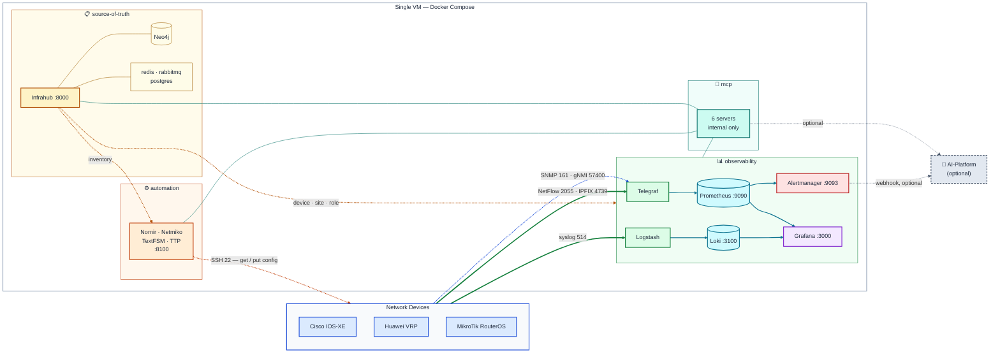
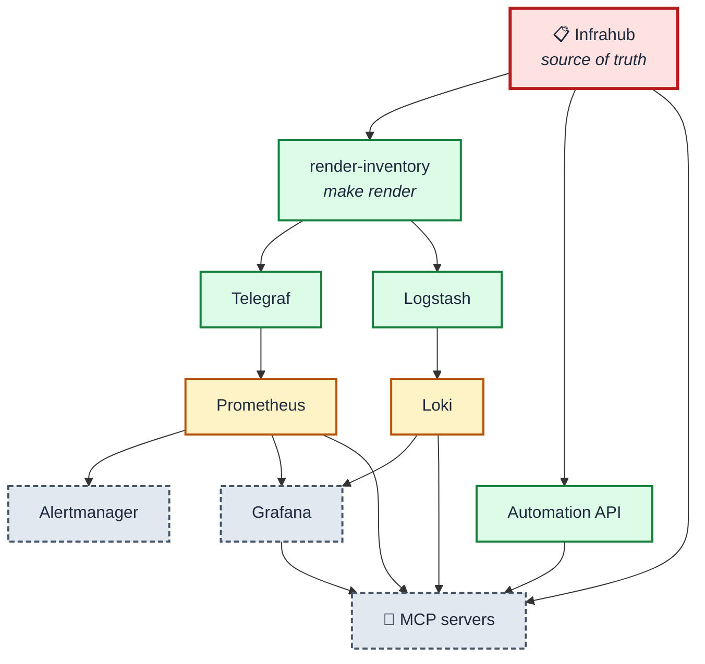

# Architecture

## Infrastructure

One VM, four container groups, three device platforms. Dashed lines are
stack-initiated (the stack reaches out); solid lines are device-initiated (the
device pushes to us). That distinction decides your firewall rules.



Ports shown are the standard values. The published host ports are configurable —
see [how-to/change-ports.md](how-to/change-ports.md).

## Component interdependency

A different question: **what breaks when something is down.** Arrows point from
a component to the things that depend on it.



**Red** — nothing else can be added or changed without it.
**Amber** — a whole class of data stops.
**Green** — one capability stops, the rest keeps running.
**Grey** — optional; losing it costs an interface, not data.

| If this is down | Still works | Stops working |
|---|---|---|
| **Infrahub** | all collection, dashboards, alerts | adding/changing devices; `make render`; automation (live inventory) |
| **render-inventory** | everything already collecting | new devices reaching the collectors |
| **Telegraf** | syslog → Loki; automation | all metrics and flows |
| **Logstash** | metrics; automation | all log ingest |
| **Prometheus** | logs; automation | metrics, alerts, metric dashboards |
| **Loki** | metrics; automation | log search, log panels |
| **Alertmanager** | everything; alerts still evaluate | alert delivery |
| **Grafana** | collection continues; alerts still fire | the UI only |
| **Automation API** | all observability | get/put config — and mcp-netmiko / mcp-assurance with it |
| **MCP servers** | **everything** | the AI-Platform interface only |

The last row is the important one. MCP sits at the bottom of the graph with
nothing depending on it, which is what makes "works with or without AI" a
structural property rather than a claim. Verify it:

```bash
COMPOSE_PROFILES=devices,automation make up
make test                                   # still green
```

## Why Infrahub sits above everything

Every collector is labelled from it. A metric from an SNMP poll and a log line
from syslog both arrive carrying the same `device`, `site` and `role`, because
`make render` writes one identity table that Telegraf and Logstash both read.

That is the whole reason a Grafana panel, a PromQL alert and a LogQL query line
up on the same device. Without it you have three tools that each know a device
by a different name.

## Ingest ownership

Each feed has exactly one owner. No feed is collected twice.

| Feed | Protocol | Who starts it | Collector | Store |
|---|---|---|---|---|
| Metrics | SNMPv3 / UDP 161 | stack pulls | **Telegraf** | Prometheus |
| Streaming telemetry | gNMI / TCP 57400 | stack pulls | **Telegraf** | Prometheus |
| Flow records | NetFlow, IPFIX / UDP | device pushes | **Telegraf** | Prometheus |
| Events | Syslog / UDP 514 | device pushes | **Logstash** | Loki |
| Config & state | SSH / TCP 22 | stack pulls + puts | **Nornir · Netmiko · TextFSM · TTP** | files + API |

Telegraf never listens for syslog; Logstash never polls a device.

## Two deliberate limits

**Flow data is aggregated at the collector.** Per-flow source and destination
addresses and ports are dropped before they reach Prometheus, because as labels
they are unbounded cardinality — a busy link would produce hundreds of thousands
of series within hours. The stack answers "how much traffic, of what kind", not
"who is talking to whom". The latter needs a flow store, which this stack does
not run.

**Assurance is vendor-neutral, and that shaped the tooling.** There is one path
for all three platforms: Netmiko gets the text, TextFSM parses tabular `show`
output, TTP parses hierarchical config, and `automation/assurance/normalise.py`
flattens the vendor differences into one shape.

A single `rules.yml` then covers the fleet, and adding a check is a YAML edit
rather than a code change. The cost is one normaliser function per platform —
about fifteen lines — which is what a second vendor-specific assurance path
would have cost many times over.
