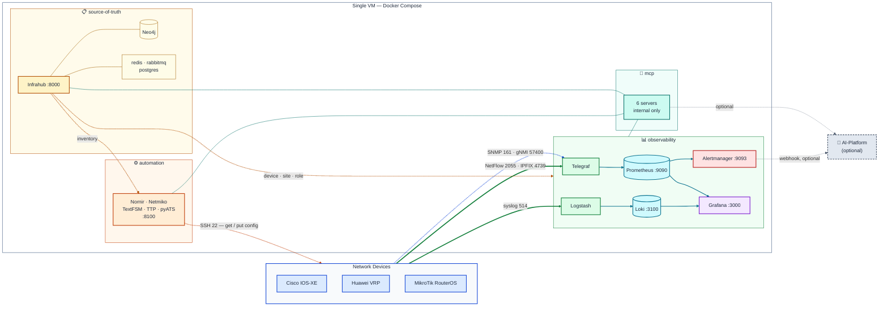
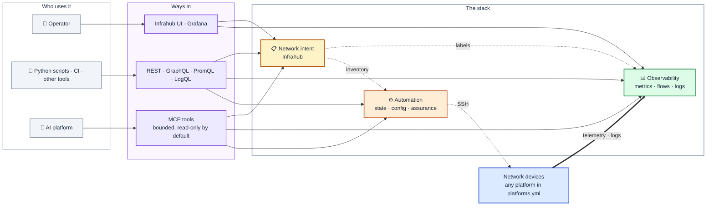
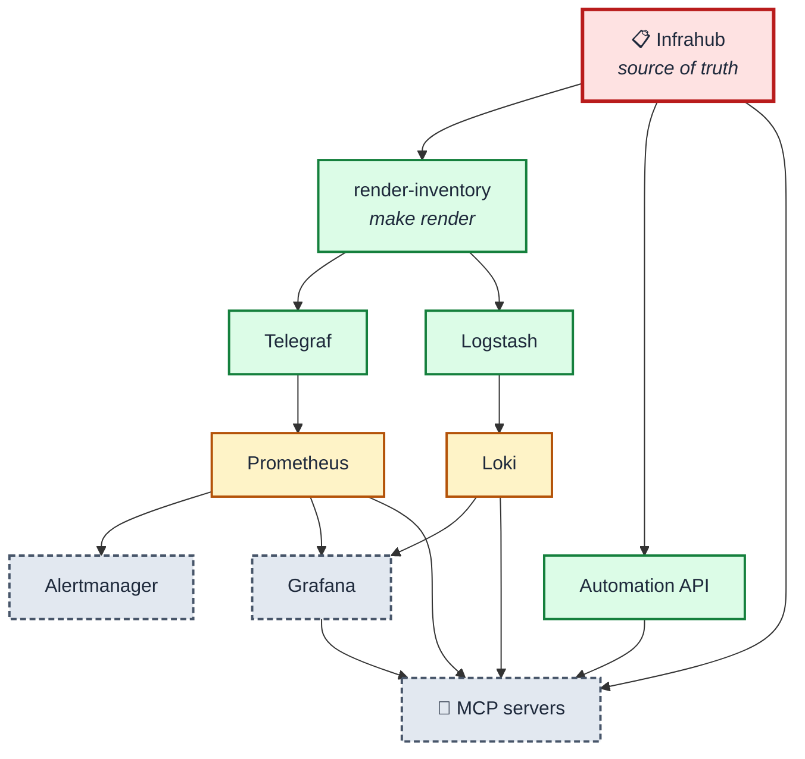
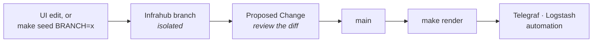
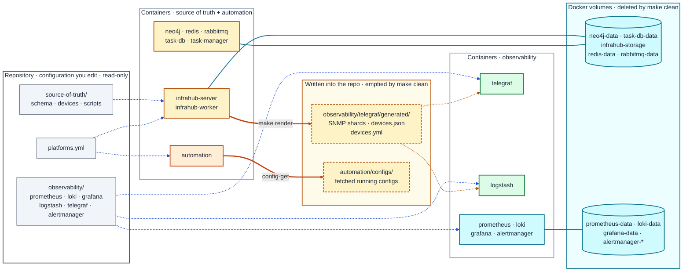

# Architecture

## Infrastructure

One VM, four container groups, three device platforms. Dashed lines are
stack-initiated (the stack reaches out); solid lines are device-initiated (the
device pushes to us). That distinction decides your firewall rules.


```mermaid
flowchart LR
  subgraph DEV["Network Devices"]
    direction TB
    C["Cisco IOS-XE"]
    H["Huawei VRP"]
    M["MikroTik RouterOS"]
  end

  subgraph VM["Single VM — Docker Compose"]
    direction TB
    subgraph SOT["📋 source-of-truth"]
      direction LR
      IH["Infrahub :8000"]
      NEO[("Neo4j")]
      SUP["redis · rabbitmq<br/>postgres"]
    end
    subgraph OBS["📊 observability"]
      direction LR
      TG["Telegraf"]
      LS["Logstash"]
      PR[("Prometheus :9090")]
      LK[("Loki :3100")]
      AM["Alertmanager :9093"]
      GF["Grafana :3000"]
    end
    subgraph AUT["⚙️ automation"]
      AU["Nornir · Netmiko<br/>TextFSM · TTP · pyATS<br/>:8100"]
    end
    subgraph MCPG["🔌 mcp"]
      MS["6 servers<br/>internal only"]
    end
  end

  AIP["🤖 AI-Platform<br/>(optional)"]

  DEV -. "SNMP 161 · gNMI 57400" .-> TG
  DEV == "NetFlow 2055 · IPFIX 4739" ==> TG
  DEV == "syslog 514" ==> LS
  AU -. "SSH 22 — get / put config" .-> DEV

  IH -. "device · site · role" .-> OBS
  IH -. "inventory" .-> AU
  IH --- NEO
  IH --- SUP
  TG --> PR --> AM
  LS --> LK
  PR --> GF
  LK --> GF
  IH --- MS
  OBS --- MS
  AU --- MS
  MS -. optional .-> AIP
  AM -. "webhook, optional" .-> AIP

  %% Colour follows the four container groups — the same grouping as the
  %% com.darqcube.group label. Light fills with explicit dark text, so the
  %% diagram stays readable in GitHub's light AND dark themes.
  classDef device  fill:#dbeafe,stroke:#1d4ed8,stroke-width:2px,color:#1e293b
  classDef sot     fill:#fef3c7,stroke:#b45309,stroke-width:2px,color:#1e293b
  classDef backing fill:#fefce8,stroke:#a16207,stroke-width:1px,color:#1e293b
  classDef collect fill:#dcfce7,stroke:#15803d,stroke-width:2px,color:#1e293b
  classDef store   fill:#cffafe,stroke:#0e7490,stroke-width:2px,color:#1e293b
  classDef alert   fill:#fee2e2,stroke:#b91c1c,stroke-width:2px,color:#1e293b
  classDef ui      fill:#f3e8ff,stroke:#7e22ce,stroke-width:2px,color:#1e293b
  classDef auto    fill:#ffedd5,stroke:#c2410c,stroke-width:2px,color:#1e293b
  classDef mcp     fill:#ccfbf1,stroke:#0f766e,stroke-width:2px,color:#1e293b
  classDef ai      fill:#e2e8f0,stroke:#475569,stroke-width:2px,stroke-dasharray:5 3,color:#1e293b

  class C,H,M device
  class IH sot
  class NEO,SUP backing
  class TG,LS collect
  class PR,LK store
  class AM alert
  class GF ui
  class AU auto
  class MS mcp
  class AIP ai

  style DEV  fill:#f8fafc,stroke:#1d4ed8,stroke-width:2px,color:#1e293b
  style VM   fill:#ffffff,stroke:#94a3b8,stroke-width:2px,color:#1e293b
  style SOT  fill:#fffbeb,stroke:#b45309,color:#1e293b
  style OBS  fill:#f0fdf4,stroke:#15803d,color:#1e293b
  style AUT  fill:#fff7ed,stroke:#c2410c,color:#1e293b
  style MCPG fill:#f0fdfa,stroke:#0f766e,color:#1e293b

  %% Thick = the device pushes to us. Dotted = we reach out to the device.
  linkStyle 0 stroke:#1d4ed8,stroke-width:2px
  linkStyle 1,2 stroke:#15803d,stroke-width:3px
  linkStyle 3 stroke:#c2410c,stroke-width:2px
  linkStyle 4,5 stroke:#b45309,stroke-width:2px
  linkStyle 6,7 stroke:#a16207,stroke-width:1px
  linkStyle 8,9,10,11,12 stroke:#0e7490,stroke-width:2px
  linkStyle 13,14,15 stroke:#0f766e,stroke-width:1px
  linkStyle 16,17 stroke:#475569,stroke-width:1px
```

Ports shown are the standard values. The published host ports are configurable —
see [how-to/change-ports.md](how-to/change-ports.md).

## Web UIs and APIs

Open `http://<host>:<port>`, where `<host>` is the VM's address or DNS name —
on OrbStack, `<machine-name>.orb.local`. `.env.example` ships **non-standard**
ports so the stack can sit beside other services; your `.env` is the
authority.

| Tool | URL path | `.env` variable | Shipped | Standard | Login |
|---|---|---|---|---|---|
| **Grafana** | `/` | `GRAFANA_PORT` | 13000 | 3000 | `GRAFANA_ADMIN_USER` / `GRAFANA_ADMIN_PASSWORD` |
| **Infrahub** | `/` · GraphQL at `/graphql` | `INFRAHUB_PORT` | 18000 | 8000 | UI: `admin` / `infrahub` · API: header `X-INFRAHUB-KEY: $INFRAHUB_ADMIN_TOKEN` |
| **Prometheus** | `/` | `PROMETHEUS_PORT` | 19090 | 9090 | none |
| **Alertmanager** | `/` | `ALERTMANAGER_PORT` | 19093 | 9093 | none |
| **Automation API** | `/docs` (Swagger) | `AUTOMATION_PORT` | 18100 | 8100 | **none** — can push config |
| **Loki** | no UI — use Grafana → **Explore** | `LOKI_PORT` | 13100 | 3100 | none |
| **MCP servers** | not published — Compose network only | — | — | — | — |

Infrahub's UI password is Infrahub's own default; this stack does not set one.
Change it after first login. `INFRAHUB_ADMIN_TOKEN` is an API token, not a UI
password.

Everything except Grafana and Infrahub is unauthenticated. Anyone who can reach
`AUTOMATION_PORT` can push configuration to every device, whatever
`MCP_ALLOW_WRITE` says. Keep these ports on a management network.

Device-facing listeners are not UIs, but for reference: syslog
`SYSLOG_PORT` (shipped 1514, standard 514 — TCP and UDP), NetFlow `NETFLOW_PORT`
(12055/udp, 2055), IPFIX `IPFIX_PORT` (14739/udp, 4739), and the dedicated
NetFlow range `FLOW_DEDICATED_FIRST`..`FLOW_DEDICATED_LAST` (12056–12105/udp,
2056–2105) for exporters behind NAT — see
[how-to/flow-behind-nat.md](how-to/flow-behind-nat.md).

## Four ways in

The stack has one core — intent, and the data labelled from it — and four ways
to use it. The two programmatic interfaces sit side by side: a Python script and
an AI agent reach the same capabilities, one over HTTP and one over MCP.


```mermaid
flowchart LR
  subgraph USE["Who uses it"]
    direction TB
    OP["👤 Operator"]
    PY["🐍 Python scripts · CI · other tools"]
    AG["🤖 AI platform"]
  end

  subgraph WAYS["Ways in"]
    direction TB
    UI["Infrahub UI · Grafana"]
    API["REST · GraphQL · PromQL · LogQL"]
    MCP["MCP tools<br/>bounded, read-only by default"]
  end

  subgraph CORE["The stack"]
    direction TB
    INT["📋 Network intent<br/>Infrahub"]
    OBSV["📊 Observability<br/>metrics · flows · logs"]
    AUTO["⚙️ Automation<br/>state · config · assurance"]
  end

  NET["Network devices<br/>any platform in platforms.yml"]

  OP --> UI
  PY --> API
  AG --> MCP
  UI --> INT
  UI --> OBSV
  API --> INT
  API --> OBSV
  API --> AUTO
  MCP --> INT
  MCP --> OBSV
  MCP --> AUTO
  INT -. "labels" .-> OBSV
  INT -. "inventory" .-> AUTO
  NET == "telemetry · logs" ==> OBSV
  AUTO -. "SSH" .-> NET

  classDef who    fill:#f1f5f9,stroke:#475569,stroke-width:1px,color:#1e293b
  classDef way    fill:#ede9fe,stroke:#6d28d9,stroke-width:1.5px,color:#1e293b
  classDef intent fill:#fef3c7,stroke:#b45309,stroke-width:2px,color:#1e293b
  classDef obs    fill:#dcfce7,stroke:#15803d,stroke-width:2px,color:#1e293b
  classDef auto   fill:#ffedd5,stroke:#c2410c,stroke-width:2px,color:#1e293b
  classDef dev    fill:#dbeafe,stroke:#1d4ed8,stroke-width:2px,color:#1e293b

  class OP,PY,AG who
  class UI,API,MCP way
  class INT intent
  class OBSV obs
  class AUTO auto
  class NET dev

  style USE  fill:#ffffff,stroke:#94a3b8,color:#1e293b
  style WAYS fill:#faf5ff,stroke:#6d28d9,color:#1e293b
  style CORE fill:#ffffff,stroke:#94a3b8,stroke-width:2px,color:#1e293b
```

| Use | Built on | Programmatic interface | For people |
|---|---|---|---|
| Network intent | Infrahub | GraphQL; YAML + `make seed` | Infrahub UI |
| Observability | Telegraf, Logstash, Prometheus, Loki | PromQL, LogQL | Grafana, Alertmanager |
| Automation | Nornir, Netmiko, TextFSM, TTP, pyATS | Automation REST API | `make` targets |
| AgenticOps | the three above, via six MCP servers | MCP | an AI platform |

AgenticOps adds no capability of its own: every MCP tool is a bounded view of
something a script can already do, which is why the stack works the same with
or without an AI platform. Scripts: [how-to/automate-with-python.md](how-to/automate-with-python.md).
Devices are a platform entry in `platforms.yml`, not code — other vendors are
added the same way: [how-to/add-a-platform.md](how-to/add-a-platform.md).

## Component interdependency

A different question: **what breaks when something is down.** Arrows point from
a component to the things that depend on it.


```mermaid
flowchart TD
  IH["📋 Infrahub<br/><i>source of truth</i>"]
  RI["render-inventory<br/><i>make render</i>"]
  TG["Telegraf"]
  LS["Logstash"]
  PR["Prometheus"]
  LK["Loki"]
  AM["Alertmanager"]
  GF["Grafana"]
  AU["Automation API"]
  MS["🔌 MCP servers"]

  IH --> RI --> TG & LS
  IH --> AU
  TG --> PR --> AM
  LS --> LK
  PR & LK --> GF
  IH & PR & LK & GF & AU --> MS

  %% Red = nothing works without it. Amber = a whole capability stops.
  %% Green = degraded but the stack keeps running. Grey = optional.
  classDef critical fill:#fee2e2,stroke:#b91c1c,stroke-width:3px,color:#1e293b
  classDef major    fill:#fef3c7,stroke:#b45309,stroke-width:2px,color:#1e293b
  classDef degraded fill:#dcfce7,stroke:#15803d,stroke-width:2px,color:#1e293b
  classDef optional fill:#e2e8f0,stroke:#475569,stroke-width:2px,stroke-dasharray:5 3,color:#1e293b

  class IH critical
  class PR,LK major
  class TG,LS,RI,AU degraded
  class GF,AM,MS optional
```

**Red** — nothing else can be added or changed without it.
**Amber** — a whole class of data stops.
**Green** — one capability stops, the rest keeps running.
**Grey** — optional; losing it costs an interface, not data.

| If this is down | Still works | Stops working |
|---|---|---|
| **Infrahub** | all collection, dashboards, alerts | adding/changing devices; `make render`; automation (live inventory) |
| **render-inventory** | everything already collecting | new devices reaching the collectors |
| **Telegraf** | syslog → Loki; automation | all metrics and flows |
| **Logstash** | metrics; automation | all log ingest |
| **Prometheus** | logs; automation | metrics, alerts, metric dashboards |
| **Loki** | metrics; automation | log search, log panels |
| **Alertmanager** | everything; alerts still evaluate | alert delivery |
| **Grafana** | collection continues; alerts still fire | the UI only |
| **Automation API** | all observability | get/put config — and mcp-netmiko / mcp-assurance with it |
| **MCP servers** | **everything** | the AI-Platform interface only |

The last row is the important one. MCP sits at the bottom of the graph with
nothing depending on it, which is what makes "works with or without AI" a
structural property rather than a claim. Verify it:

```bash
COMPOSE_PROFILES=devices,automation make up
make test                                   # still green
```

## Why Infrahub sits above everything

Every collector is labelled from it. A metric from an SNMP poll and a log line
from syslog both arrive carrying the same `device`, `site` and `role`, because
`make render` writes one identity table that Telegraf and Logstash both read.

That is the whole reason a Grafana panel, a PromQL alert and a LogQL query line
up on the same device. Without it you have three tools that each know a device
by a different name.

### How a change reaches the collectors


```mermaid
flowchart LR
  E["UI edit, or<br/>make seed BRANCH=x"] --> B["Infrahub branch<br/><i>isolated</i>"]
  B --> P["Proposed Change<br/><i>review the diff</i>"]
  P --> M["main"]
  M --> R["make render"]
  R --> C["Telegraf · Logstash<br/>automation"]
```

Render and automation read only `main`, and only `active` devices. A device
staged on an unmerged branch is never polled or connected to, which makes the
merge the review gate. `make seed` validates every record against the loaded
schema before writing anything, so the YAML cannot carry a field Infrahub does
not know.

What render writes for each device is decided by three of its attributes:

| Attribute | Decides |
|---|---|
| `management_host` / `management_ip` | the address polled and SSHed to — the DNS name when set. The identity table also keys the IP, because flow records arrive from a source address, never a name |
| `telemetry_mode` | SNMP or gNMI — never both |
| `snmp_security` | which SNMP input polls it. Telegraf takes one security level per input, so authNoPriv devices (images that cannot encrypt) get separate inputs rather than lowering the fleet |

**Intent vs reality.** Render also writes one `intent_device` series per
active device (`generated/intent.influx`, read by `generated/intent.conf`).
Prometheus compares it with what actually reports: `device:not_reporting`
names every device that is in Infrahub but silent, the `DeviceNotReporting`
alert fires on it, and the dashboards show it — "is everything we own
monitored?" answered from the source of truth, not from guesswork.

**Assurance as metrics.** With `ASSURANCE_INTERVAL_MINUTES` set, the
automation service runs the assurance rules on every device on a schedule
and exposes `assurance_rule_state` at `/metrics`; Prometheus scrapes it like
any collector. "Is the network behaving as intended?" then has a history and
an alert, not only an on-demand answer.

Step by step: [administration/infrahub-guide.md](administration/infrahub-guide.md).

### What the network serves (optional)

Besides sites and devices, Infrahub can hold **prefixes, hosts, applications
and services** — which servers run which applications on which ports, in which
subnets, behind which gateway. The AI platform reads them through `mcp-infrahub`
(`get_application_dependencies` and friends), and `make render` turns the
services into NetFlow lookup tables so every flow carries `application` and
`criticality` ([how-to/label-flows-by-application.md](how-to/label-flows-by-application.md)).
Seeded like devices: [how-to/model-applications.md](how-to/model-applications.md).

**Auto-render (optional).** With the `auto-render` profile, Infrahub calls
`render-hook` on every change to `main` and the render happens by itself —
[how-to/auto-render.md](how-to/auto-render.md).

## Ingest ownership

Each feed has exactly one owner. No feed is collected twice.

| Feed | Protocol | Who starts it | Collector | Store |
|---|---|---|---|---|
| Metrics | SNMPv3 / UDP 161 | stack pulls | **Telegraf** | Prometheus |
| Streaming telemetry | gNMI / TCP 57400 | stack pulls | **Telegraf** | Prometheus |
| Flow records | NetFlow, IPFIX / UDP | device pushes | **Telegraf** | Prometheus |
| Events | Syslog / TCP or UDP 514 | device pushes | **Logstash** | Loki |
| Config & state | SSH / TCP 22 | stack pulls + puts | **Nornir · Netmiko · TextFSM · TTP · pyATS** | files + API |

Telegraf never listens for syslog; Logstash never polls a device.

Flow records are labelled from the identity table by source address — or, for
an exporter behind NAT, by the dedicated listener it was sent to (device
`flow_port`, [how-to/flow-behind-nat.md](how-to/flow-behind-nat.md)).

## Volumes and storage

One rule decides where everything lives: **configuration comes from the
repository through bind mounts; state lives in Docker volumes.** The repo is
what you version and edit. The volumes are what the running stack accumulates.


```mermaid
flowchart LR
  subgraph REPO["Repository · configuration you edit · read-only"]
    direction TB
    CFG_SOT["source-of-truth/<br/>schema · devices · scripts"]
    PLAT["platforms.yml"]
    CFG_OBS["observability/<br/>prometheus · loki · grafana<br/>logstash · telegraf · alertmanager"]
  end

  subgraph SOTC["Containers · source of truth + automation"]
    direction TB
    BACK["neo4j · redis · rabbitmq<br/>task-db · task-manager"]
    IH["infrahub-server<br/>infrahub-worker"]
    AU["automation"]
  end

  subgraph WR["Written into the repo · emptied by make clean"]
    direction TB
    GEN["observability/telegraf/generated/<br/>SNMP shards · devices.json<br/>devices.yml"]
    CONFS["automation/configs/<br/>fetched running configs"]
  end

  subgraph OBSC["Containers · observability"]
    direction TB
    TG["telegraf"]
    LS["logstash"]
    OBS["prometheus · loki<br/>grafana · alertmanager"]
  end

  subgraph VOL["Docker volumes · deleted by make clean"]
    direction TB
    V_SOT[("neo4j-data · task-db-data<br/>infrahub-storage<br/>redis-data · rabbitmq-data")]
    V_OBS[("prometheus-data · loki-data<br/>grafana-data · alertmanager-*")]
  end

  CFG_SOT -.-> IH
  PLAT -.-> IH
  PLAT -.-> AU
  CFG_OBS -.-> TG
  CFG_OBS -.-> LS
  CFG_OBS -.-> OBS
  IH == "make render" ==> GEN
  AU == "config-get" ==> CONFS
  GEN -.-> TG
  GEN -.-> LS
  IH --- V_SOT
  BACK --- V_SOT
  OBS --- V_OBS

  %% Grey = configuration you edit. Amber = folders a container writes back
  %% into the repo — make clean empties them. Cyan = Docker-managed state.
  %% Containers keep their group colours from the diagrams above.
  classDef cfg     fill:#f1f5f9,stroke:#475569,stroke-width:1px,color:#1e293b
  classDef written fill:#fef3c7,stroke:#b45309,stroke-width:2px,stroke-dasharray:5 3,color:#1e293b
  classDef vol     fill:#cffafe,stroke:#0e7490,stroke-width:2px,color:#1e293b
  classDef sot     fill:#fef3c7,stroke:#b45309,stroke-width:2px,color:#1e293b
  classDef collect fill:#dcfce7,stroke:#15803d,stroke-width:2px,color:#1e293b
  classDef store   fill:#cffafe,stroke:#0e7490,stroke-width:2px,color:#1e293b
  classDef auto    fill:#ffedd5,stroke:#c2410c,stroke-width:2px,color:#1e293b

  class CFG_SOT,PLAT,CFG_OBS cfg
  class GEN,CONFS written
  class V_SOT,V_OBS vol
  class IH,BACK sot
  class TG,LS collect
  class OBS store
  class AU auto

  style REPO fill:#ffffff,stroke:#475569,stroke-width:2px,color:#1e293b
  style SOTC fill:#ffffff,stroke:#94a3b8,stroke-width:2px,color:#1e293b
  style OBSC fill:#ffffff,stroke:#94a3b8,stroke-width:2px,color:#1e293b
  style WR   fill:#fffbeb,stroke:#b45309,stroke-width:2px,color:#1e293b
  style VOL  fill:#ecfeff,stroke:#0e7490,stroke-width:2px,color:#1e293b

  %% 0-5 read-only mounts · 6-7 writes · 8-9 generated read back · 10-12 volumes
  linkStyle 0,1,2,3,4,5 stroke:#1d4ed8,stroke-width:1.5px
  linkStyle 6,7 stroke:#c2410c,stroke-width:3px
  linkStyle 8,9 stroke:#b45309,stroke-width:1.5px
  linkStyle 10,11,12 stroke:#0e7490,stroke-width:2px
```

**Grey** — configuration you edit, mounted read-only (dotted blue).
**Amber, dashed** — folders a container writes back into the repo (thick
orange). Gitignored, emptied by `make clean`, and `generated/` is read back by
Telegraf and Logstash (dotted amber).
**Cyan** — Docker-managed state. `make clean` deletes it.

### Named volumes — the state

Docker-managed, stored under `/var/lib/docker/volumes/`. Invisible to `git`,
and deleted by `make clean`.

| Volume | Group | Used by | Holds | If lost |
|---|---|---|---|---|
| `neo4j-data` | source-of-truth | `neo4j` | the Infrahub graph — every device, site and role | see below |
| `neo4j-logs` | source-of-truth | `neo4j` | Neo4j logs | nothing of value |
| `task-db-data` | source-of-truth | `task-db` | Postgres for Infrahub's embedded Prefect | Infrahub task history |
| `task-manager-data` | source-of-truth | `task-manager` | Prefect home | nothing of value |
| `infrahub-storage` | source-of-truth | `infrahub-server`, `infrahub-worker` | Infrahub artifacts, shared by both | Infrahub-side files |
| `redis-data` | source-of-truth | `redis` | Infrahub's cache | nothing — rebuilt on demand |
| `rabbitmq-data` | source-of-truth | `rabbitmq` | Infrahub's message queue | nothing — transient |
| `prometheus-data` | observability | `prometheus` | every metric | metric history (~4 GB per 15 days at 400 devices) |
| `loki-data` | observability | `loki` | every log line | log history |
| `grafana-data` | observability | `grafana` | users, sessions, preferences | little — dashboards come from the repo |
| `alertmanager-data` | observability | `alertmanager` | silences and notification state | active silences |
| `alertmanager-config` | observability | `config-init` writes, `alertmanager` reads | the rendered `alertmanager.yml` | nothing — regenerated at every start |

**`neo4j-data` is only irreplaceable if Infrahub was edited through its UI.**
Everything that arrived through `source-of-truth/devices/*.yml` rebuilds with
`make schema && make seed` — which is the argument for making production
device changes through the YAML.

Those files are **not in the repo**: they are each deployment's own inventory,
gitignored like `.env` and `site.yml`, and exist only on the VM. So the YAML is
the source of truth for the source of truth only if it is backed up.

**What to back up**, in order: `.env`, `site.yml` and
`source-of-truth/devices/*.yml` — small, and the only copy; `neo4j-data` and
`task-db-data` if Infrahub has been edited directly; `prometheus-data` and
`loki-data` if history matters. Everything else regenerates.

### Bind mounts — the configuration

Folders in the repository, mounted into containers. `make clean` does **not**
touch the read-only ones; it empties the two written ones.

**Read-only** — containers consume these and never write them. Edit on the
host, then restart or reload the service.

| Host path | Mounted into | As |
|---|---|---|
| `platforms.yml` | `infrahub-server`, `automation` | the vendor matrix |
| `source-of-truth/schema/` | `infrahub-server` | `/schema` |
| `source-of-truth/devices/` | `infrahub-server` | `/devices` |
| `source-of-truth/scripts/` | `infrahub-server` | `/scripts` — seed and render run here |
| `observability/telegraf/profiles/` | `infrahub-server` | `/profiles` — SNMP templates the renderer expands per shard |
| `observability/prometheus/` | `prometheus` | config and rules |
| `observability/loki/` | `loki` | `loki.yml` |
| `observability/grafana/provisioning/` | `grafana` | datasources and dashboards |
| `observability/alertmanager/alertmanager.yml.tmpl` | `config-init` | the template it renders from |
| `observability/logstash/pipeline/` | `logstash` | the syslog pipeline |
| `observability/logstash/patterns/` | `logstash` | vendor grok patterns |
| `observability/telegraf/telegraf.conf` | `telegraf` | agent settings |
| `observability/telegraf/conf.d/` | `telegraf` | netflow, gNMI, outputs |

**Written by a container** — the two exceptions, where a container writes back
into the repo tree. Both are gitignored apart from a `.gitkeep`.

| Host path | Written by | Read by | Holds |
|---|---|---|---|
| `observability/telegraf/generated/` | `infrahub-server` (`make render`); `config-init` writes empty `devices.json`/`devices.yml` only if none exist | `telegraf`, `logstash` | SNMP and gNMI shards, `netflow-dedicated.conf`, `devices.json`, `devices.yml` |
| `automation/configs/` | `automation` | — | running configs fetched from devices |

`generated/` is a bind mount rather than a volume on purpose: it is where every
doc, `verify.sh` and the wiring test look for rendered output, and you can read
it on the host to see exactly what Telegraf and Logstash were given. The
renderer runs as root and Logstash reads as uid 1000, so the renderer sets its
files to `0644` explicitly rather than trusting the container's umask.

`automation/` is mounted as a whole so templates and tasks can be edited on the
host and retried without rebuilding the image. The container itself only ever
writes `automation/configs/`.

### What `make clean` removes — and what it does not

`make clean` asks first, then does two things:

1. `docker compose down -v` — deletes **every named volume** above.
2. Deletes every file except `.gitkeep` in the two **written** bind mounts,
   `observability/telegraf/generated/` and `automation/configs/`.

So after a clean:

- **All state is gone**: metrics, logs, the Infrahub graph, Grafana users.
- **Rendered config and fetched device configs are gone.**
- **All configuration you edit is untouched** — it is the repo. So are
  `site.yml` and `.env`.

Step 2 exists because `down -v` only removes *named* volumes; a bind mount is
a host folder and Docker leaves it alone. Without it, a stale `generated/`
kept Telegraf polling the previous install's devices until the next
`make render` — and could make the wiring test and `verify.sh` pass for an
install that had rendered nothing. And fetched running configs, which contain
SNMP communities and local password hashes, outlived the install.

If `docker compose down -v` fails, `make clean` stops and deletes nothing
else. The files are owned by root, but deleting them needs only write access
to the folder, which is yours — no `sudo`.

### Where it physically lives

```bash
docker volume ls --filter label=com.docker.compose.project=darqcube
docker system df -v | grep darqcube_          # size of each volume
```

Named volumes are prefixed with the project name — `darqcube_prometheus-data`
and so on — because `compose.yaml` sets `name: darqcube`.

## Two deliberate limits

**Flow data is aggregated at the collector.** Per-flow source and destination
addresses and ports are dropped before they reach Prometheus, because as labels
they are unbounded cardinality — a busy link would produce hundreds of thousands
of series within hours. The stack answers "how much traffic, of what kind", not
"who is talking to whom". The latter needs a flow store, which this stack does
not run.

**Assurance has two engines, and pyATS is additive.** TextFSM covers interface
state on every platform: `automation/assurance/normalise.py` flattens three
vendors' CLI formats into one shape, so a single rule set covers the fleet.

pyATS/Genie runs on top wherever Genie genuinely returns data — Cisco fully,
Huawei for BGP only, MikroTik not at all. It is never a platform's only path,
so a gap in Genie's coverage cannot silently remove a platform's checks; an
unsupported rule reports `skipped` rather than `pass`. What each platform gets
is declared in `platforms.yml` and verified against the installed Genie by a
test that runs inside the automation image.
