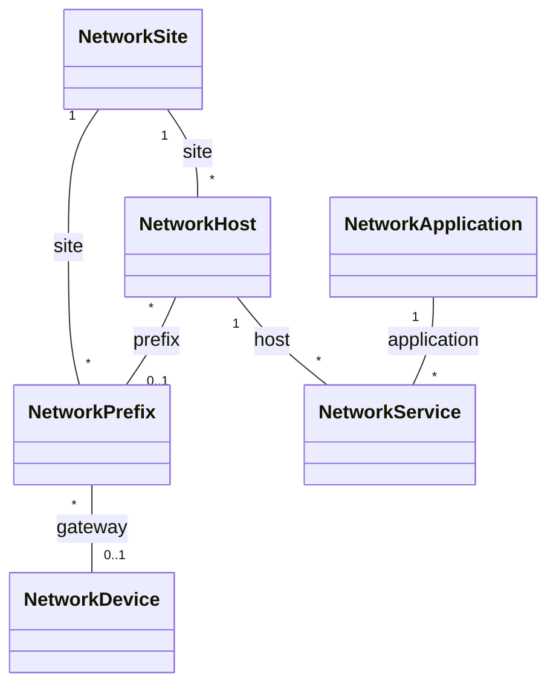

# Model what the network serves — hosts, applications, services, prefixes

Devices and sites tell the stack **what to monitor**. Hosts, applications,
services and prefixes tell it **why the network matters**: which servers run
which applications, on which ports, in which subnets, behind which gateway.
With them in Infrahub, the AI platform can answer "what breaks if this router
fails?" or "where does ERP run?" from the source of truth instead of guessing.

All four are **optional**. A deployment that models only devices is unaffected.

## The model



| Kind | Is | Key fields |
|---|---|---|
| **Prefix** | a subnet at a site | `prefix` (CIDR), `purpose` (users, servers, transit, management, dmz, internet), `vlan_id`, `site`, `gateway` (a device) |
| **Host** | a server, workstation, gateway or appliance | `host_type`, `address`, `site`, `prefix`, `operating_system` |
| **Application** | a business application | `category`, `criticality` (low → critical), `owner` |
| **Service** | one listening endpoint of an application on a host | `host`, `application`, `protocol` (tcp/udp), `port` |

An application with several endpoints (HTTP and HTTPS, or DNS over UDP and
TCP) has one service per endpoint. A host may run services of several
applications.

## Worked example

Start from the shipped examples — they extend the device examples (sites
`hq` and `branch-01`, devices `router1` and `mt-01`):

```sh
cp source-of-truth/devices/examples/{prefixes,hosts,applications,services}.yml source-of-truth/devices/
```

`prefixes.yml` — the server and user subnets, and who routes them:

```yaml
prefixes:
  - name: hq-servers
    prefix: 10.0.10.0/24
    purpose: servers
    vlan_id: 20
    site: hq
    gateway: router1
```

`hosts.yml` — the servers, placed in a prefix:

```yaml
hosts:
  - name: srv-db-01
    site: hq
    host_type: server
    address: 10.0.10.12
    prefix: hq-servers
```

`applications.yml` and `services.yml` — what runs where:

```yaml
applications:
  - name: erp
    category: database
    criticality: critical
    owner: finance-it

services:
  - name: srv-db-01-postgres
    host: srv-db-01
    application: erp
    protocol: tcp
    port: 5432
```

Then, as for devices:

```sh
make seed          # validates everything first; writes nothing on any error
```

Files can be split however you like — every `*.yml` in
`source-of-truth/devices/` is read, and all are gitignored.

## What `make seed` refuses

| Problem | Why it matters |
|---|---|
| a service with no port, or a port outside 1–65535 | flows are matched on the port |
| two services with the same protocol and port on one host | a flow would match two applications |
| a host that runs services but has no `address` | nothing can be matched to it |
| a host address outside the prefix it names | the subnet, and so the gateway, would be wrong |
| a prefix that is not strict CIDR (`10.0.10.5/24`) | almost always a typo for a host or a subnet |
| a host, application, site or gateway that does not exist | the relationship would point nowhere |

Order between files does not matter; between sections it is fixed by the seed
(prefixes before hosts before services), so a record can refer to anything
seeded before it.

## Where it is used

| Consumer | How |
|---|---|
| **AI platform (MCP)** | `list_applications`, `get_application`, `get_host`, `get_site_services`, `get_application_dependencies` on `mcp-infrahub` — see [connect-an-ai-platform.md](connect-an-ai-platform.md) |
| **NetFlow** | every flow labelled with `application` and `criticality` after `make render` — [label-flows-by-application.md](label-flows-by-application.md) |
| **Grafana and alerts** | the Applications dashboard; `CriticalApplicationSilent` |
| **Infrahub UI** | the four kinds appear in the menu; relationships are browsable both ways |
| **Automation** | the same GraphQL, for intent checks of your own |

## Verify

```sh
make seed | tail -1      # "... N prefixes, N hosts, N applications, N services"
```

In the Infrahub UI, open an application and follow its services to hosts,
prefixes and gateway devices. From the AI platform, `get_application_dependencies`
on a critical application lists the hosts that deliver it and the network
devices it depends on.

## Generating it

Hosts and prefixes usually exist somewhere already — a CMDB, a spreadsheet, a
lab topology. Generate the YAML from that source rather than typing it: the
seed format is plain YAML, one list per section, and the examples show every
field. Keep the generated files in `source-of-truth/devices/`, and re-run
`make seed` when they change.
